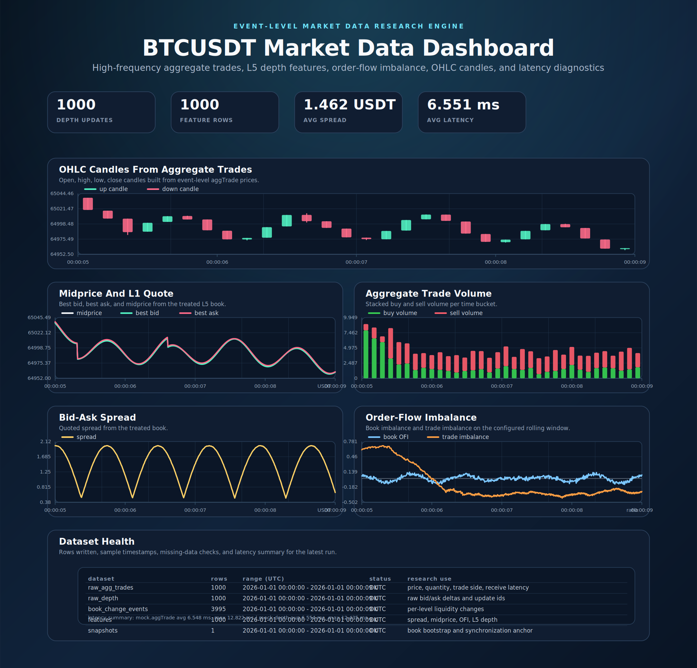
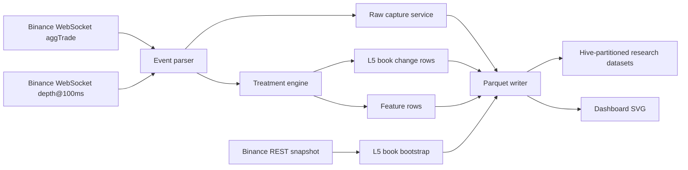

# crypto-market-data-research-engine

Standalone C#/.NET market-data pipeline for collecting Binance high-frequency crypto data, treating it into research-ready microstructure features, and storing it as Parquet.

This repository is intentionally focused on data engineering and quant research. It contains only public market-data extraction, treatment, diagnostics, and storage code.



## What It Does

The project captures Binance market data at event level and writes typed datasets that can be used for market microstructure research.

- Collects Binance `aggTrade` events from WebSocket.
- Collects Binance order book updates from the high-frequency `depth@100ms` WebSocket stream.
- Bootstraps the local book from the Binance REST depth snapshot.
- Reconstructs an L5 local order book.
- Writes raw depth frames, raw aggregate trades, book-change rows, derived features, and snapshots.
- Stores each dataset as hive-partitioned Parquet.
- Tracks receive latency for WebSocket diagnostics.
- Produces a large centered SVG dashboard with stacked time-series panels, OHLC candles, volume, spread, imbalance, depth, book-change mix, latency, and dataset health.
- Includes a smoke test that runs the full mock pipeline, writes Parquet, reads it back, validates columns, checks data-quality invariants, and exits successfully.

## Architecture



The live collector connects to:

```text
wss://stream.binance.com:9443/stream?streams=btcusdt@depth@100ms/btcusdt@aggTrade
```

The raw capture path is event-triggered, not timer-sampled:

- `raw_agg_trades`: one row per Binance aggregate trade event.
- `raw_depth`: one row per Binance depth update frame.
- `book_change_events`: one row per changed bid or ask level inside the processed L5 book update.
- `features`: one row per depth event by default, or throttled by `--feature-interval-ms`.
- `snapshots`: one row when the collector bootstraps the local book from REST.

## Repository Layout

```text
crypto-market-data-research-engine/
├── README.md
├── crypto-market-data-research-engine.sln
├── src/
│   └── CryptoMarketDataResearchEngine/
│       ├── Collectors/
│       ├── Configuration/
│       ├── Diagnostics/
│       ├── Export/
│       ├── Models/
│       ├── Storage/
│       ├── Treatment/
│       ├── PipelineRunner.cs
│       └── Program.cs
├── tests/
│   └── CryptoMarketDataResearchEngine.SmokeTests/
├── sample_data/
│   └── smoke/
├── charts/
│   └── market-data-pipeline-dashboard.svg
├── .env.example
└── .gitignore
```

## Main Components

`Collectors/BinanceWebSocketCollector.cs`

Live Binance ingestion. It starts with a REST depth snapshot, opens a Binance combined WebSocket stream, parses `aggTrade` and `depthUpdate` messages, records receive latency, and sends typed rows to storage and treatment.

`Collectors/MockBinanceCollector.cs`

Deterministic local collector used by the smoke test. It simulates high-frequency trades and depth updates so the project can be validated without depending on Binance availability.

`Treatment/BookTreatmentEngine.cs`

Maintains a local order book and creates research features from the event stream. It computes best bid, best ask, midprice, spread, microprice, L5 depth, order-flow imbalance, rolling buy/sell volume, trade imbalance, and rolling add/cancel pressure.

`Storage/ParquetMarketDataWriter.cs`

Writes typed datasets to Parquet. Files are partitioned by dataset, symbol, UTC date, and UTC hour.

`Diagnostics/WebSocketLatencyTracker.cs`

Tracks event timestamp versus local receive timestamp so live runs can report WebSocket receive-latency summaries.

`Diagnostics/MarketDataQualityValidator.cs`

Checks that captured values are internally coherent. The smoke test fails if any strict validation check fails.

`Export/DashboardSvgRenderer.cs`

Generates the large dashboard image at `charts/market-data-pipeline-dashboard.svg` after collection. The dashboard is built from the same captured rows that are sent to Parquet, using a bounded in-memory sample so the visualization stays tied to the actual pipeline output.

## Dashboard

The generated SVG is intentionally arranged as a single centered research dashboard instead of a two-column grid. All time-series panels are stacked vertically so each chart has the same width and comparable time axis.

Dashboard panels (simplified):

- OHLC candlesticks built from aggregate trade prices (time-bucketed).
- Midprice, best bid, and best ask reconstructed from the treated L5 book (L1 quote).
- Aggregate buy/sell trade volume (stacked bars).
- WebSocket latency diagnostics for aggregate trades and depth updates.
- Dataset health table with row counts and latency summary.

Notes:

- Visualizations are downsampled to a maximum of 500 plotted datapoints per series to keep the SVG size reasonable while preserving the full captured dataset for auditing and metrics.
- The dashboard renderer now draws x-axis time ticks and a time legend for each panel.
- Metric cards use the full, undownsampled row counts so captured-data counts remain accurate.
- The dashboard SVG is produced by `Export/DashboardSvgRenderer.cs` and written to `charts/market-data-pipeline-dashboard.svg`.
- To regenerate the dashboard as part of the smoke test, run:

```bash
dotnet run --project tests/CryptoMarketDataResearchEngine.SmokeTests
```

Latency interpretation:

- In mock mode, latency is deterministic synthetic jitter with occasional spikes. It should be bounded and irregular, not a perfect sawtooth.
- In live mode, latency is measured as local receive timestamp minus Binance event or trade timestamp. Real values should have jitter and occasional spikes due to network, exchange timestamping, local scheduling, and message batching.
- A perfectly repeating latency pattern in mock data is usually a generator artifact, not a live-market property.

## Datasets

Data is written under:

```text
<output>/<dataset>/symbol=<SYMBOL>/date_utc=<YYYY-MM-DD>/hour_utc=<HH>/part-*.parquet
```

Datasets:

- `raw_agg_trades`: aggregate trade id, price, quantity, maker side, inferred buy/sell side, event time, trade time, receive latency, optional raw payload.
- `raw_depth`: first update id, last update id, bid update JSON, ask update JSON, update counts, receive latency, optional raw payload.
- `book_change_events`: side, price, previous quantity, new quantity, delta quantity, event type, best-level flag, update ids.
- `features`: best bid, best ask, midprice, spread, microprice, L5 depth, order-flow imbalance, trade imbalance, rolling add/cancel quantities.
- `snapshots`: REST depth snapshot metadata and serialized top book levels.

## Captured Data Inventory

This is the complete persisted data contract written by the current pipeline.

`raw_agg_trades`

One row per Binance aggregate trade event.

- `event_ts_ms`: Binance event timestamp in Unix milliseconds.
- `event_ts_iso`: Binance event timestamp in ISO-8601 UTC format.
- `trade_ts_ms`: Binance trade timestamp in Unix milliseconds.
- `local_receive_ts_ms`: local machine receive timestamp in Unix milliseconds.
- `symbol`: normalized symbol, for example `BTCUSDT`.
- `exchange`: constant exchange label, currently `binance`.
- `agg_trade_id`: Binance aggregate trade id.
- `first_trade_id`: first raw trade id included in the aggregate trade.
- `last_trade_id`: last raw trade id included in the aggregate trade.
- `price`: aggregate trade price.
- `quantity`: aggregate trade base-asset quantity.
- `buyer_is_maker`: Binance maker-side flag.
- `trade_side`: inferred aggressive side; `buy` when buyer is taker, `sell` when buyer is maker.
- `receive_latency_ms`: local receive time minus Binance trade timestamp.
- `raw_payload_json`: original exchange payload when `--raw-payload true`; empty string otherwise.

`raw_depth`

One row per Binance depth update frame.

- `event_ts_ms`: Binance depth event timestamp in Unix milliseconds.
- `event_ts_iso`: Binance depth event timestamp in ISO-8601 UTC format.
- `local_receive_ts_ms`: local machine receive timestamp in Unix milliseconds.
- `symbol`: normalized symbol.
- `exchange`: constant exchange label, currently `binance`.
- `first_update_id`: first Binance order-book update id in the frame.
- `last_update_id`: final Binance order-book update id in the frame.
- `bid_updates_json`: serialized bid price/size updates from the frame.
- `ask_updates_json`: serialized ask price/size updates from the frame.
- `bid_update_count`: number of bid levels included in the frame.
- `ask_update_count`: number of ask levels included in the frame.
- `receive_latency_ms`: local receive time minus Binance depth event timestamp.
- `raw_payload_json`: original exchange payload when `--raw-payload true`; empty string otherwise.

`book_change_events`

One row per changed book level after applying a depth update to the local book.

- `event_ts_ms`: source depth event timestamp in Unix milliseconds.
- `event_ts_iso`: source depth event timestamp in ISO-8601 UTC format.
- `local_receive_ts_ms`: local receive timestamp in Unix milliseconds.
- `symbol`: normalized symbol.
- `exchange`: constant exchange label, currently `binance`.
- `event_type`: `limit_add` when displayed quantity increases, otherwise `cancel_or_trade`.
- `side`: `bid` or `ask`.
- `price`: changed price level.
- `previous_quantity`: quantity at that price before the update.
- `new_quantity`: quantity at that price after the update.
- `delta_quantity`: signed quantity change.
- `absolute_delta_quantity`: absolute quantity change.
- `is_best_level`: whether the updated level was the best level before applying the side update.
- `first_update_id`: first Binance update id from the source frame.
- `last_update_id`: final Binance update id from the source frame.
- `book_last_update_id`: local book update id after applying the event.

`features`

One row per treated depth event by default. Set `--feature-interval-ms` above zero to throttle derived feature emission.

- `event_ts_ms`: feature event timestamp in Unix milliseconds.
- `event_ts_iso`: feature event timestamp in ISO-8601 UTC format.
- `local_compute_ts_ms`: local feature-computation timestamp in Unix milliseconds.
- `symbol`: normalized symbol.
- `exchange`: constant exchange label, currently `binance`.
- `feature_interval_ms`: configured minimum feature interval. `0` means one feature row per depth event.
- `rolling_window_ms`: configured rolling window for trade-flow and book-change features.
- `book_last_update_id`: latest local book update id included in the feature row.
- `best_bid`: best bid price.
- `best_ask`: best ask price.
- `midprice`: `(best_bid + best_ask) / 2`.
- `spread`: `best_ask - best_bid`, floored at zero.
- `microprice`: queue-size weighted top-of-book price.
- `best_bid_size`: displayed quantity at best bid.
- `best_ask_size`: displayed quantity at best ask.
- `total_bid_depth_l5`: total displayed bid depth across the top five bid levels.
- `total_ask_depth_l5`: total displayed ask depth across the top five ask levels.
- `bid_l1_price`: level-1 bid price.
- `bid_l2_price`: level-2 bid price.
- `bid_l3_price`: level-3 bid price.
- `bid_l4_price`: level-4 bid price.
- `bid_l5_price`: level-5 bid price.
- `bid_l1_size`: level-1 bid quantity.
- `bid_l2_size`: level-2 bid quantity.
- `bid_l3_size`: level-3 bid quantity.
- `bid_l4_size`: level-4 bid quantity.
- `bid_l5_size`: level-5 bid quantity.
- `ask_l1_price`: level-1 ask price.
- `ask_l2_price`: level-2 ask price.
- `ask_l3_price`: level-3 ask price.
- `ask_l4_price`: level-4 ask price.
- `ask_l5_price`: level-5 ask price.
- `ask_l1_size`: level-1 ask quantity.
- `ask_l2_size`: level-2 ask quantity.
- `ask_l3_size`: level-3 ask quantity.
- `ask_l4_size`: level-4 ask quantity.
- `ask_l5_size`: level-5 ask quantity.
- `order_flow_imbalance`: `(total_bid_depth_l5 - total_ask_depth_l5) / (total_bid_depth_l5 + total_ask_depth_l5)`.
- `buy_trade_volume_window`: rolling aggressive buy volume.
- `sell_trade_volume_window`: rolling aggressive sell volume.
- `trade_imbalance`: `(buy_trade_volume_window - sell_trade_volume_window) / total rolling trade volume`.
- `limit_add_bid_window`: rolling bid-side displayed quantity additions.
- `limit_add_ask_window`: rolling ask-side displayed quantity additions.
- `cancel_bid_window`: rolling bid-side displayed quantity removals.
- `cancel_ask_window`: rolling ask-side displayed quantity removals.

`snapshots`

One row per REST depth snapshot used to bootstrap the local book.

- `event_ts_ms`: snapshot capture timestamp in Unix milliseconds.
- `event_ts_iso`: snapshot capture timestamp in ISO-8601 UTC format.
- `local_receive_ts_ms`: local receive timestamp in Unix milliseconds.
- `symbol`: normalized symbol.
- `exchange`: constant exchange label, currently `binance`.
- `last_update_id`: Binance snapshot update id.
- `bids_json`: serialized bid levels from the snapshot.
- `asks_json`: serialized ask levels from the snapshot.
- `bid_level_count`: number of bid levels included in the snapshot.
- `ask_level_count`: number of ask levels included in the snapshot.
- `depth_synchronized`: whether the local depth bootstrap completed successfully.
- `resync_count`: reserved counter for future depth resync tracking.

Sidecar metadata for every Parquet file:

- `dataset`: dataset name.
- `symbol`: normalized symbol.
- `exchange`: exchange label.
- `rows`: number of rows in the Parquet file.
- `hour_utc`: partition hour represented by the file.
- `file`: Parquet file name.
- `schema_version`: schema identifier, currently `event-level-v1`.

Each Parquet file also gets a small `.meta.json` sidecar with dataset name, row count, symbol, exchange, partition hour, file name, and schema version.

## Automated Quality Checks

Every capture run attaches a `QualityChecks` array to the JSON result. The smoke test runs these checks in strict mode.

The validator checks:

- Required row counts for mock smoke output.
- Snapshot presence and synchronization flag.
- Monotonic timestamps for depth, trade, and feature rows.
- Symbol consistency across all sampled rows.
- Positive trade prices and quantities.
- Correct `trade_side` mapping from Binance `buyer_is_maker`.
- Ordered trade id and depth update id ranges.
- Non-negative receive latency.
- Bounded synthetic latency in mock mode.
- Non-negative displayed quantities after book updates.
- Correct `absolute_delta_quantity = abs(delta_quantity)`.
- Valid book-change `event_type` and `side` values.
- Positive best bid and best ask.
- Non-crossed book: `best_bid <= best_ask`.
- Correct spread calculation.
- Correct midprice calculation.
- Microprice inside the best bid/ask quote.
- Non-negative top-five bid and ask depth.
- Best bid/ask sizes matching L1 size columns.
- L1-L5 bid ladder sorted descending.
- L1-L5 ask ladder sorted ascending.
- Order-flow imbalance and trade imbalance within `[-1, 1]`.
- Non-negative rolling trade, limit-add, and cancel quantities.

For live runs, row-count minimums are reported but not enforced because short captures can legitimately have sparse trade activity.

## Requirements

- .NET SDK 10.0 or newer.
- Internet access for live Binance collection.
- No API key is needed for public Binance market data.

Check your .NET SDK:

```bash
dotnet --version
```

## Configuration

Command-line options can be passed directly:

```bash
dotnet run --project src/CryptoMarketDataResearchEngine -- collect \
  --mode mock \
  --symbol BTCUSDT \
  --duration 10 \
  --output sample_data/smoke \
  --dataset all \
  --feature-interval-ms 0 \
  --rolling-window-ms 1000
```

The same values can be supplied through environment variables:

```text
SYMBOL=BTCUSDT
MODE=mock
OUTPUT_PATH=sample_data/smoke
CAPTURE_DURATION_SECONDS=10
DATASET_TYPE=all
REST_DEPTH_LIMIT=1000
FEATURE_INTERVAL_MS=0
ROLLING_WINDOW_MS=1000
RAW_PAYLOAD=false
```

Important options:

- `--mode mock`: generate deterministic local market data for tests and demos.
- `--mode live`: connect to Binance public WebSocket and REST depth snapshot.
- `--symbol BTCUSDT`: symbol to collect.
- `--duration 30`: capture duration in seconds.
- `--output data/binance`: output root path.
- `--dataset all`: write all datasets, or choose one dataset name.
- `--feature-interval-ms 0`: emit one feature row per depth event. Set a positive value to downsample only derived features.
- `--rolling-window-ms 1000`: rolling window used for trade and book-change features.
- `--raw-payload true`: store raw JSON payloads. Default is false to keep files smaller.

## Run The Smoke Test

The smoke test uses the mock collector, writes Parquet sample data, reads every dataset back, checks required columns, and generates the dashboard image.

```bash
dotnet run --project tests/CryptoMarketDataResearchEngine.SmokeTests
```

Passing result from this local run:

```text
SMOKE TEST PASSED
output_path=sample_data/smoke
rows_written={"raw_depth":1000,"raw_agg_trades":1000,"book_change_events":3995,"features":1000,"snapshots":1}
quality_checks=34/34 passed
chart=charts/market-data-pipeline-dashboard.svg
```

Build verification:

```bash
dotnet build crypto-market-data-research-engine.sln
```

Passing result from this local run:

```text
Build succeeded.
0 Warning(s)
0 Error(s)
```

## Run A Mock Collection

```bash
dotnet run --project src/CryptoMarketDataResearchEngine -- collect \
  --mode mock \
  --symbol BTCUSDT \
  --duration 10 \
  --output sample_data/mock_run \
  --mock-events-per-second 250
```

This writes synthetic but structurally realistic data. It is useful for validating downstream readers, dashboards, and schema contracts.

## Run A Live Binance Collection

```bash
dotnet run --project src/CryptoMarketDataResearchEngine -- collect \
  --mode live \
  --symbol BTCUSDT \
  --duration 30 \
  --output data/binance \
  --feature-interval-ms 0
```

Live mode uses public Binance endpoints only. It does not need credentials.

For longer runs, write to `data/binance` or another local path that is ignored by Git:

```bash
dotnet run --project src/CryptoMarketDataResearchEngine -- collect \
  --mode live \
  --symbol ETHUSDT \
  --duration 300 \
  --output data/binance_eth \
  --raw-payload false
```

## Inspect Written Parquet

```bash
dotnet run --project src/CryptoMarketDataResearchEngine -- inspect --output sample_data/smoke
```

The inspect command lists each dataset, the number of Parquet files, row groups, and detected columns.

## Research Ideas

This project is built to support market microstructure analysis and public data research.

- Trade volume over time from `raw_agg_trades.quantity`.
- Buy versus sell volume using `trade_side`.
- Bid-ask spread from `features.spread`.
- Midprice and microprice drift from `features.midprice` and `features.microprice`.
- L5 liquidity imbalance from `total_bid_depth_l5` and `total_ask_depth_l5`.
- Order-flow imbalance from `features.order_flow_imbalance`.
- Short-window trade imbalance from `features.trade_imbalance`.
- Limit add pressure and cancel pressure from the rolling add/cancel feature columns.
- Latency analysis using `receive_latency_ms` in raw trade and depth datasets.
- Data quality checks using update id continuity, empty side updates, duplicate timestamps, and missing book levels.

## Design Notes

The pipeline is intentionally concise:

- Raw market events are written at event level.
- Derived feature frequency is configurable.
- Row models are explicit C# records.
- Storage schemas are explicit Parquet columns.
- Live and mock collectors share the same sink and treatment path.
- Sample data is small enough to keep in Git.
- Large or long-running captures should stay under ignored `data/` paths.

## Scope Boundaries

The standalone repository is limited to market-data research infrastructure:

- Public Binance market-data collection.
- Event-level parsing and row models.
- L5 book treatment.
- Research feature generation.
- Parquet storage.
- Diagnostics and sample visualization.
- No private keys, local secret files, or account credentials.

## Limitations

- Binance depth updates are collected from `depth@100ms`, which is Binance's high-frequency public diff-depth stream for this endpoint.
- `aggTrade` is aggregate trade data, not private order-level data.
- The current writer flushes at the end of a capture run. Very long production captures should add periodic flush rotation.
- The sample dashboard is generated as SVG for portability and GitHub rendering.
