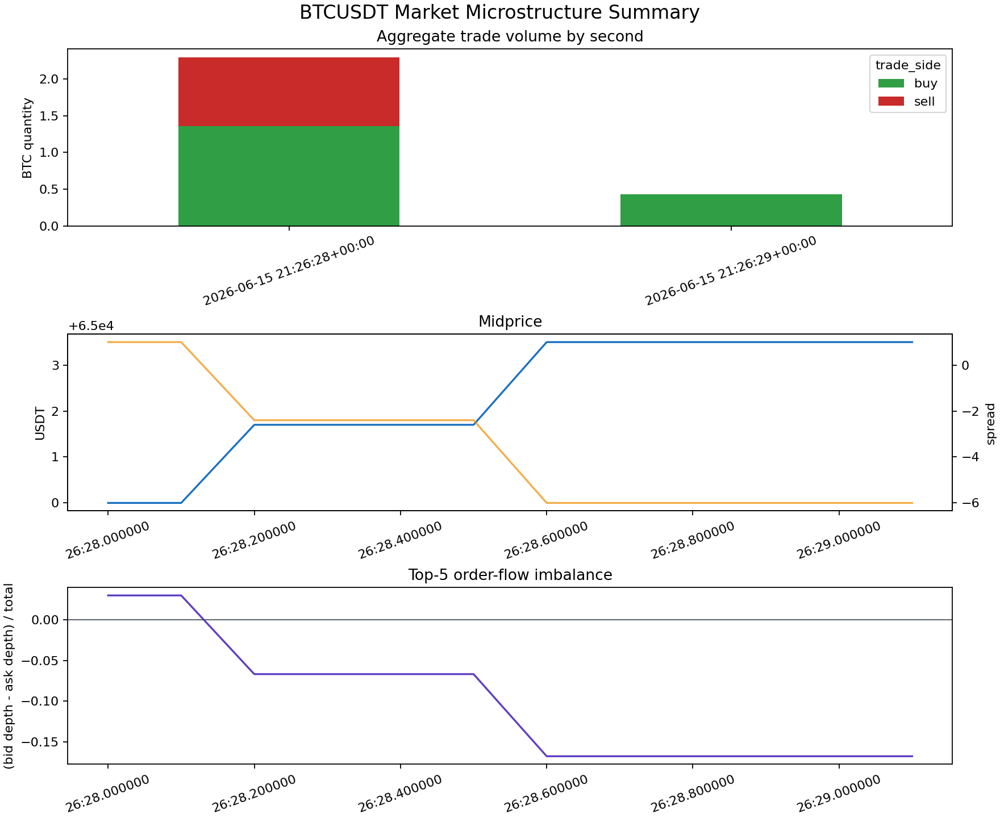
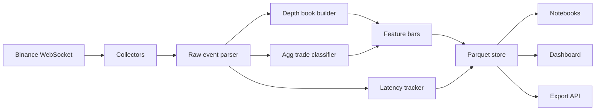
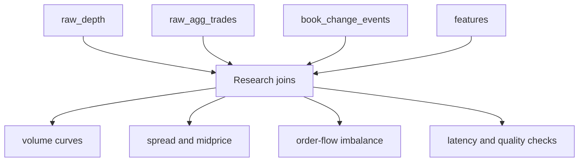

# crypto-market-data-research-engine

A standalone Binance high-frequency market-data pipeline for crypto market microstructure research.

The project focuses only on data collection, storage, diagnostics, export, and research. It does not contain order placement, strategy engines, risk management, portfolio accounting, wallets, private keys, or credentials.



## What It Does

This repository collects BTCUSDT market data from Binance and stores it in analysis-ready datasets.

It captures:

- aggregate trades from `btcusdt@aggTrade`
- depth updates from `btcusdt@depth@100ms`
- top-of-book and L5 order-book features
- raw depth messages
- classified book changes such as limit additions and liquidity removals
- 100 ms feature bars for microstructure research
- WebSocket latency diagnostics

The default smoke test runs in deterministic mock mode, so the repository can be tested without internet access or exchange availability. Live Binance collection is available through the same CLI.

## Architecture





## Project Layout

```text
crypto-market-data-research-engine/
├── README.md
├── src/
│   ├── collectors/      # Binance live collector and deterministic mock collector
│   ├── diagnostics/     # WebSocket latency tracking
│   ├── export/          # charts, Streamlit dashboard, optional FastAPI export API
│   ├── models/          # row models and dataset column definitions
│   └── storage/         # Hive-partitioned Parquet/CSV writer and readers
├── notebooks/           # data quality and microstructure analysis notebooks
├── sample_data/         # committed synthetic sample output from the smoke test
├── charts/              # generated visualization artifacts
├── tests/               # smoke test
├── .env.example
├── .gitignore
└── requirements.txt
```

## Datasets

The writer stores data in Hive-style partitions:

```text
<output>/<dataset>/symbol=BTCUSDT/date_utc=YYYY-MM-DD/hour_utc=HH/part-*.parquet
```

Main datasets:

- `raw_agg_trades`: trade id, price, quantity, buyer-maker flag, inferred taker side, event time, local receive time, latency
- `raw_depth`: raw bid/ask deltas, Binance update ids, event time, local receive time, latency
- `book_change_events`: per-level size changes classified as liquidity additions or removals
- `features`: 100 ms bars with midprice, spread, top-5 bid/ask depth, order-flow imbalance, trade imbalance
- `snapshots`: bootstrap book snapshots and synchronization metadata

## Setup

```bash
python3 -m venv .venv
source .venv/bin/activate
pip install -r requirements.txt
```

The smoke test can also run in the provided environment if `pandas`, `pyarrow`, and `matplotlib` are already installed.

## Run The Collector

Mock mode is deterministic and safe for local testing:

```bash
python3 -m src.cli collect --mode mock --symbol BTCUSDT --duration 3 --output sample_data/demo --dataset all
```

Live Binance mode uses public market-data endpoints only:

```bash
python3 -m src.cli collect --mode live --symbol BTCUSDT --duration 30 --output data/binance --dataset all
```

Useful options:

- `--symbol BTCUSDT`: Binance symbol
- `--output data/binance`: dataset root
- `--duration 30`: capture duration in seconds
- `--dataset all`: one of `all`, `raw_depth`, `raw_agg_trades`, `book_change_events`, `snapshots`, `features`
- `--bar-ms 100`: feature-bar interval
- `--format parquet`: use `parquet` or `csv`

## Smoke Test

The smoke test runs the deterministic mock collector, writes Parquet datasets, reads them back, verifies expected columns, and generates the chart shown at the top of this README.

Command used:

```bash
python3 tests/smoke_test.py
```

Passing result from the local run:

```text
SMOKE TEST PASSED
output_path=sample_data/smoke
datasets_written={'raw_depth': 12, 'raw_agg_trades': 12, 'book_change_events': 12, 'features': 12, 'snapshots': 2}
latency=[{'source': 'mock.agg_trade', 'samples': 12, 'average_ms': 5.75, 'min_ms': 4.0, 'max_ms': 8.0}, {'source': 'mock.depth', 'samples': 12, 'average_ms': 5.75, 'min_ms': 4.0, 'max_ms': 8.0}]
chart=charts/market_microstructure_summary.png
```

## Analysis

Generate research charts from an existing dataset root:

```bash
python3 -m src.cli analyze --input sample_data/smoke --charts charts
```

Open the notebooks:

```bash
jupyter notebook notebooks/
```

Run the dashboard:

```bash
streamlit run src/export/dashboard.py
```

Run the optional export API:

```bash
uvicorn src.export.api:app --reload
```

## Research Indicators

This data supports several market microstructure features:

- trade volume over time by inferred taker side
- bid-ask spread and midprice
- top-of-book depth and top-5 depth imbalance
- order-flow imbalance from bid and ask depth
- trade imbalance from buyer-initiated versus seller-initiated flow
- liquidity replenishment and depletion around the best bid/ask
- WebSocket latency by stream
- snapshot freshness and update-id continuity

These features are useful for exploratory quant research, data-quality screens, short-horizon signal research, and exchange microstructure diagnostics.

## Design Notes

This project is intentionally narrow. It keeps the reusable market-data ideas and rewrites them as a small research engine:

- no order placement
- no portfolio state
- no strategy modules
- no dependency on the source application
- deterministic sample data for review and CI-friendly testing
